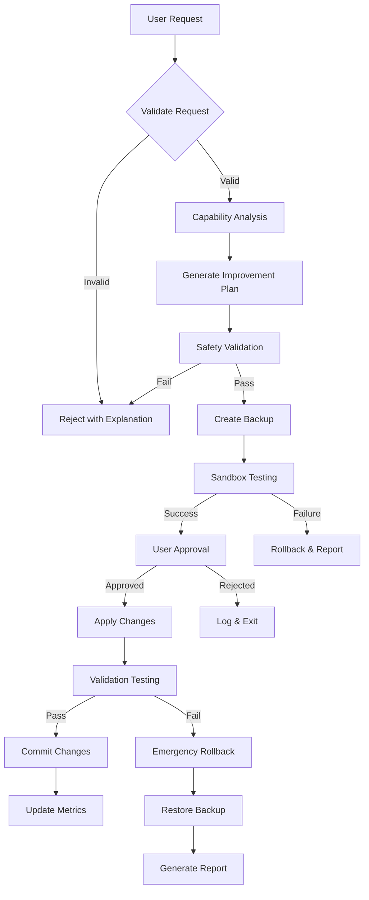

# improve-self

**Task ID:** `improve-self`  
**Version:** 2.0.0  
**Status:** Active

---

## Purpose

Enable the meta-agent to improve its own capabilities with comprehensive safeguards. This task allows self-modification with mandatory safety checks, backups, and user approval.

---

## Execution Modes

**Choose your execution mode:**

### 1. YOLO Mode - Fast, Autonomous (0-1 prompts)
- Autonomous decision making with logging
- Minimal user interaction
- **Best for:** Simple, deterministic tasks

### 2. Interactive Mode - Balanced, Educational (5-10 prompts) **[DEFAULT]**
- Explicit decision checkpoints
- Educational explanations
- **Best for:** Learning, complex decisions

### 3. Pre-Flight Planning - Comprehensive Upfront Planning
- Task analysis phase (identify all ambiguities)
- Zero ambiguity execution
- **Best for:** Ambiguous requirements, critical work

**Parameter:** `mode` (optional, default: `interactive`)

**Valid values:** `yolo`, `interactive`, `preflight`

**Note:** For self-improvement tasks, interactive mode is strongly recommended to ensure user awareness and approval of changes.

---

## Task Definition (AIOS Task Format V1.0)

```yaml
task: improveSelf()
responsável: Orion (Commander)
responsavel_type: Agente
atomic_layer: Molecule

**Entrada:**
- campo: task
  tipo: string
  origem: User Input
  obrigatório: true
  validação: Must be registered task

- campo: parameters
  tipo: object
  origem: User Input
  obrigatório: false
  validação: Valid task parameters

- campo: mode
  tipo: string
  origem: User Input
  obrigatório: false
  validação: yolo|interactive|pre-flight

**Saída:**
- campo: execution_result
  tipo: object
  destino: Memory
  persistido: false

- campo: logs
  tipo: array
  destino: File (.ai/logs/*)
  persistido: true

- campo: state
  tipo: object
  destino: State management
  persistido: true
```

---

## Pre-Conditions

**Purpose:** Validate prerequisites BEFORE task execution (blocking)

**Checklist:**

```yaml
pre-conditions:
  - [ ] Task is registered; required parameters provided; dependencies met
    tipo: pre-condition
    blocker: true
    validação: |
      Check task is registered; required parameters provided; dependencies met
    error_message: "Pre-condition failed: Task is registered; required parameters provided; dependencies met"
```

---

## Step-by-Step Execution

### Step 1: Request Validation

**Purpose:** Validate improvement request against safety rules

**Actions:**
1. Parse improvement request
2. Check against safety rules
3. Verify scope limitations
4. Detect recursive improvements

**Validation:**
- Request is valid
- No safety violations
- Scope within limits
- No recursive improvements detected

---

### Step 2: Capability Analysis

**Purpose:** Analyze current implementation and identify improvement opportunities

**Actions:**
1. Analyze current implementation
2. Identify improvement opportunities
3. Assess feasibility and risks
4. Generate capability report

**Validation:**
- Analysis completed
- Opportunities identified
- Risks assessed
- Report generated

---

### Step 3: Improvement Planning

**Purpose:** Generate specific improvement plan with implementation details

**Actions:**
1. Generate specific changes
2. Create implementation plan
3. Identify affected components
4. Estimate impact and benefits

**Validation:**
- Plan generated
- Changes specified
- Components identified
- Impact estimated

---

### Step 4: Safety Validation

**Purpose:** Validate improvement plan against safety constraints

**Actions:**
1. Check for breaking changes
2. Verify interface preservation
3. Validate security implications
4. Ensure rollback capability

**Validation:**
- No breaking changes
- Interfaces preserved
- Security validated
- Rollback available

---

### Step 5: Backup Creation

**Purpose:** Create full backup before applying changes

**Actions:**
1. Full backup of affected files
2. State snapshot for recovery
3. Version control checkpoint
4. Recovery plan documentation

**Validation:**
- Backup created
- State saved
- Checkpoint created
- Recovery plan documented

---

### Step 6: Sandbox Testing

**Purpose:** Test improvements in isolated environment

**Actions:**
1. Create isolated test environment
2. Apply changes in sandbox
3. Run comprehensive test suite
4. Validate functionality

**Validation:**
- Sandbox created
- Changes applied
- Tests passed
- Functionality validated

---

### Step 7: User Approval

**Purpose:** Request explicit user approval before applying changes

**Actions:**
1. Present improvement plan
2. Show test results
3. Display risk assessment
4. Request explicit approval

**Validation:**
- Plan presented
- Results shown
- Risks disclosed
- Approval obtained

---

### Step 8: Change Application

**Purpose:** Apply approved improvements to production

**Actions:**
1. Apply approved changes
2. Monitor for issues
3. Validate in production
4. Track performance metrics

**Validation:**
- Changes applied
- No issues detected
- Production validated
- Metrics tracked

---

## Post-Conditions

**Purpose:** Validate execution success AFTER task completes

**Checklist:**

```yaml
post-conditions:
  - [ ] Task completed; exit code 0; expected outputs created
    tipo: post-condition
    blocker: true
    validação: |
      Verify task completed; exit code 0; expected outputs created
    rollback: true
    error_message: "Post-condition failed: Task completed; exit code 0; expected outputs created"
```

---

## Acceptance Criteria

**Purpose:** Validate story requirements AFTER workflow (non-blocking, can be manual)

**Checklist:**

```yaml
acceptance-criteria:
  - [ ] Task completed as expected; side effects documented
    tipo: acceptance-criterion
    blocker: false
    story: N/A
    manual_check: true
    validação: |
      Assert task completed as expected; side effects documented
    error_message: "Acceptance criterion not met: Task completed as expected; side effects documented"
```

---

## Tools (External/Shared)

**Purpose:** Catalog reusable tools used by multiple agents

```yaml
**Tools:**
- github-cli:
    version: latest
    used_for: Version control operations and issue creation
    shared_with: [dev, qa, po]
    cost: $0

- task-runner:
    version: latest
    used_for: Task execution and orchestration
    shared_with: [dev, qa, po]
    cost: $0

- logger:
    version: latest
    used_for: Execution logging and error tracking
    shared_with: [dev, qa, po]
    cost: $0
```

---

## Scripts (Agent-Specific)

**Purpose:** Agent-specific code for this task

```yaml
**Scripts:**
- capability-analyzer.js:
    description: Analyze current capabilities and identify improvements
    language: JavaScript
    location: .aios-core/scripts/capability-analyzer.js

- improvement-validator.js:
    description: Validate improvement plans against safety rules
    language: JavaScript
    location: .aios-core/scripts/improvement-validator.js

- sandbox-tester.js:
    description: Test improvements in isolated sandbox environment
    language: JavaScript
    location: .aios-core/scripts/sandbox-tester.js

- backup-manager.js:
    description: Manage backups and rollback operations
    language: JavaScript
    location: .aios-core/scripts/backup-manager.js
```

---

## Error Handling

**Strategy:** abort

**Common Errors:**

1. **Error:** Safety Validation Failed
   - **Cause:** Improvement plan violates safety rules
   - **Resolution:** Review safety constraints, modify plan
   - **Recovery:** Reject improvement, log reason, suggest alternatives

2. **Error:** Sandbox Testing Failed
   - **Cause:** Tests fail in sandbox environment
   - **Resolution:** Fix issues in improvement plan
   - **Recovery:** Rollback sandbox, restore backup, reject improvement

3. **Error:** User Rejected Improvement
   - **Cause:** User did not approve improvement plan
   - **Resolution:** Accept user decision, log feedback
   - **Recovery:** Cleanup temporary files, exit gracefully

4. **Error:** Emergency Rollback Required
   - **Cause:** Critical failure during change application
   - **Resolution:** Immediately restore backup
   - **Recovery:** Restore all files from backup, log incident, alert user

---

## Performance

**Expected Metrics:**

```yaml
duration_expected: 5-15 min (estimated)
cost_estimated: $0.002-0.008
token_usage: ~2,000-5,000 tokens
```

**Optimization Notes:**
- Cache capability analysis results
- Parallelize sandbox tests where possible
- Implement early exits on safety violations

---

## Metadata

```yaml
story: STORY-6.1.7.2
version: 2.0.0
dependencies:
  - capability-analyzer.js
  - improvement-validator.js
  - sandbox-tester.js
  - backup-manager.js
tags:
  - automation
  - meta-improvement
  - self-modification
updated_at: 2025-01-17
```

## Task Flow



## Required Input

```yaml
request: "Description of desired self-improvement"
scope: "specific|general"  # specific = targeted improvement, general = broad optimization
target_areas:  # Optional list of areas to improve
  - performance
  - error_handling
  - capabilities
  - code_quality
constraints:  # Optional safety constraints
  max_files: 10
  require_tests: true
  preserve_interfaces: true
```

## Execution Steps

1. **Request Validation**
   - Parse improvement request
   - Check against safety rules
   - Verify scope limitations
   - Detect recursive improvements

2. **Capability Analysis**
   - Analyze current implementation
   - Identify improvement opportunities
   - Assess feasibility and risks
   - Generate capability report

3. **Improvement Planning**
   - Generate specific changes
   - Create implementation plan
   - Identify affected components
   - Estimate impact and benefits

4. **Safety Validation**
   - Check for breaking changes
   - Verify interface preservation
   - Validate security implications
   - Ensure rollback capability

5. **Backup Creation**
   - Full backup of affected files
   - State snapshot for recovery
   - Version control checkpoint
   - Recovery plan documentation

6. **Sandbox Testing**
   - Create isolated test environment
   - Apply changes in sandbox
   - Run comprehensive test suite
   - Validate functionality

7. **User Approval**
   - Present improvement plan
   - Show test results
   - Display risk assessment
   - Request explicit approval

8. **Change Application**
   - Apply approved changes
   - Monitor for issues
   - Validate in production
   - Track performance metrics

9. **Post-Implementation**
   - Update documentation
   - Record in modification history
   - Generate metrics report
   - Schedule follow-up review

## Output Format

```yaml
improvement_id: "self-imp-{timestamp}-{hash}"
status: "completed|failed|rolled_back"
analysis:
  current_capabilities:
    - capability: "error handling"
      score: 7.5
      issues: ["no retry logic", "basic error messages"]
  proposed_improvements:
    - area: "error handling"
      changes: ["add retry mechanism", "enhance error context"]
      impact: "medium"
      risk: "low"
modifications:
  - file: "utils/error-handler.js"
    type: "enhancement"
    changes: 15
    tests_added: 3
validation:
  sandbox_results:
    tests_passed: 45
    tests_failed: 0
    performance_impact: "+5%"
  safety_checks:
    breaking_changes: false
    interface_preserved: true
    security_validated: true
metrics:
  improvement_score: 8.2
  risk_score: 2.1
  confidence: 0.87
rollback_info:
  backup_id: "backup-123"
  restore_command: "node restore.js backup-123"
```

## Safety Rules

### Mandatory Safeguards
1. **No Core System Modifications**
   - Cannot modify bootstrap files
   - Cannot change security validators
   - Cannot alter rollback mechanisms
   - Cannot modify safety checks

2. **Recursive Protection**
   - Detect circular improvements
   - Limit improvement depth to 1
   - Track improvement history
   - Prevent infinite loops

3. **Interface Preservation**
   - All public APIs must remain compatible
   - Task interfaces cannot change
   - Command signatures preserved
   - Configuration formats maintained

4. **Test Requirements**
   - All changes must have tests
   - Existing tests must pass
   - Coverage cannot decrease
   - Performance benchmarks met

5. **Approval Gates**
   - User approval required
   - Change summary mandatory
   - Risk assessment shown
   - Rollback plan available

### Safe Mode Fallback
```javascript
// Always maintain safe mode entry point
if (process.env.AIOS_SAFE_MODE === 'true') {
  console.log('Running in safe mode - self-modification disabled');
  process.exit(0);
}
```

## Implementation

```javascript
const CapabilityAnalyzer = require('../scripts/capability-analyzer');
const ImprovementValidator = require('../scripts/improvement-validator');
const SandboxTester = require('../scripts/sandbox-tester');
const BackupManager = require('../scripts/backup-manager');
// const MetricsTracker = require('../scripts/metrics-tracker'); // Archived in Story 3.18

module.exports = {
  name: 'improve-self',
  description: 'Enable meta-agent self-improvement with safeguards',
  
  async execute(params) {
    const { request, scope = 'specific', target_areas = [], constraints = {} } = params;
    
    // Initialize safety systems
    const validator = new ImprovementValidator();
    const analyzer = new CapabilityAnalyzer();
    const sandbox = new SandboxTester();
    const backup = new BackupManager();
    // const metrics = new MetricsTracker(); // Archived in Story 3.18
    
    try {
      // Step 1: Validate request
      const validation = await validator.validateRequest({
        request,
        scope,
        constraints
      });
      
      if (!validation.valid) {
        return {
          success: false,
          reason: validation.reason,
          suggestions: validation.suggestions
        };
      }
      
      // Step 2: Analyze capabilities
      const analysis = await analyzer.analyzeCapabilities({
        target_areas,
        currentImplementation: './aios-core'
      });
      
      // Step 3: Generate improvement plan
      const plan = await analyzer.generateImprovementPlan({
        analysis,
        request,
        constraints
      });
      
      // Step 4: Safety validation
      const safety = await validator.validateSafety(plan);
      if (!safety.safe) {
        return {
          success: false,
          reason: 'Safety validation failed',
          risks: safety.risks
        };
      }
      
      // Step 5: Create backup
      const backupId = await backup.createFullBackup({
        files: plan.affectedFiles,
        metadata: {
          improvement_id: plan.id,
          timestamp: new Date().toISOString()
        }
      });
      
      // Step 6: Sandbox testing
      const sandboxResults = await sandbox.testImprovements({
        plan,
        backupId
      });
      
      if (!sandboxResults.success) {
        await backup.restoreBackup(backupId);
        return {
          success: false,
          reason: 'Sandbox testing failed',
          results: sandboxResults
        };
      }
      
      // Step 7: User approval
      const approval = await this.requestUserApproval({
        plan,
        analysis,
        sandboxResults,
        safety
      });
      
      if (!approval.approved) {
        return {
          success: false,
          reason: 'User rejected improvements',
          user_feedback: approval.feedback
        };
      }
      
      // Step 8: Apply changes
      const application = await this.applyImprovements({
        plan,
        backupId
      });
      
      // Step 9: Post-implementation
      await metrics.recordImprovement({
        improvement_id: plan.id,
        metrics: application.metrics,
        analysis,
        plan
      });
      
      return {
        success: true,
        improvement_id: plan.id,
        analysis,
        modifications: application.modifications,
        metrics: application.metrics,
        rollback_info: {
          backup_id: backupId,
          restore_command: `*restore-backup ${backupId}`
        }
      };
      
    } catch (error) {
      // Emergency rollback
      if (backup.hasActiveBackup()) {
        await backup.emergencyRestore();
      }
      
      return {
        success: false,
        error: error.message,
        emergency_rollback: true
      };
    }
  },
  
  async requestUserApproval({ plan, analysis, sandboxResults, safety }) {
    console.log(chalk.yellow('\n=== SELF-IMPROVEMENT APPROVAL REQUEST ===\n'));
    
    console.log(chalk.blue('Improvement Plan:'));
    console.log(`- Target: ${plan.target_areas.join(', ')}`);
    console.log(`- Files affected: ${plan.affectedFiles.length}`);
    console.log(`- Risk level: ${safety.risk_level}`);
    
    console.log(chalk.blue('\nProposed Changes:'));
    plan.changes.forEach(change => {
      console.log(`- ${change.description}`);
      console.log(`  Impact: ${change.impact}, Risk: ${change.risk}`);
    });
    
    console.log(chalk.green('\nSandbox Test Results:'));
    console.log(`- Tests passed: ${sandboxResults.tests_passed}/${sandboxResults.total_tests}`);
    console.log(`- Performance impact: ${sandboxResults.performance_impact}`);
    console.log(`- No breaking changes: ${sandboxResults.no_breaking_changes}`);
    
    const { approve } = await inquirer.prompt([{
      type: 'confirm',
      name: 'approve',
      message: 'Do you approve these self-improvements?',
      default: false
    }]);
    
    if (approve) {
      const { feedback } = await inquirer.prompt([{
        type: 'input',
        name: 'feedback',
        message: 'Any additional constraints or feedback?'
      }]);
      
      return { approved: true, feedback };
    }
    
    return { approved: false };
  }
};
```

## Dependencies
- capability-analyzer.js
- improvement-validator.js
- sandbox-tester.js
- backup-manager.js
- modification-history.js
- git-wrapper.js

## Test Requirements
- Sandbox environment setup
- Mock improvement scenarios
- Safety validation tests
- Rollback verification
- Metrics accuracy tests

## Security Considerations
- All improvements require explicit approval
- Sandbox testing mandatory
- Full backup before changes
- Emergency rollback available
- Audit trail maintained
- Safe mode bypass available

## Common Improvements
1. **Error Handling Enhancement**
   - Add retry logic
   - Improve error messages
   - Add context tracking

2. **Performance Optimization**
   - Optimize algorithms
   - Add caching layers
   - Reduce I/O operations

3. **Capability Extension**
   - Add new utility functions
   - Enhance existing features
   - Improve integrations

4. **Code Quality**
   - Refactor complex functions
   - Improve modularity
   - Enhance documentation

## Metrics Tracked
- Improvement success rate
- Performance impact
- Code quality scores
- Test coverage changes
- User satisfaction
- Rollback frequency 