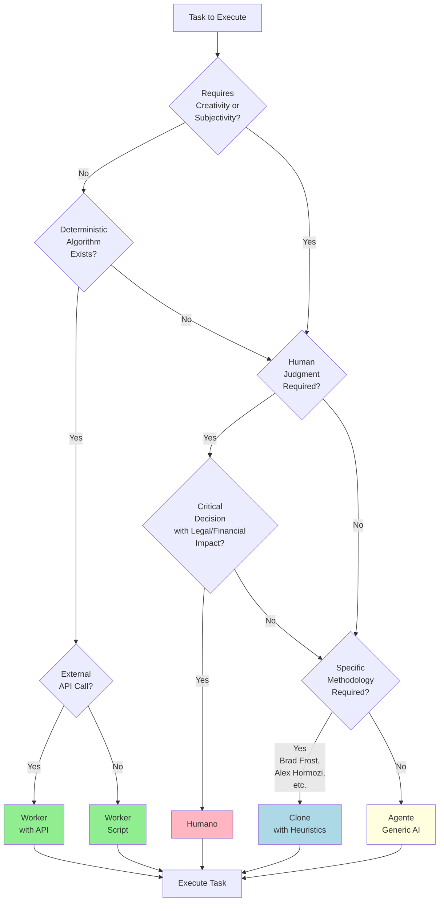

# AIOS Executor Decision Tree

**Date:** 2025-11-13  
**Version:** 1.0.0  
**Status:** Standard  
**Author:** Brad Frost Cognitive Clone

---

## Purpose

This document defines HOW to choose the appropriate executor type (Agente, Worker, Humano, Clone) for any AIOS Task based on task characteristics, requirements, and constraints.

---

## The Four Executor Types

### 1. Agente (AI-Powered Execution)

**Definition:** AI agent that uses Large Language Models to perform creative, analytical, or generative tasks.

**When to use:**
- Task requires creativity or subjective judgment
- Task involves natural language understanding/generation
- Task needs contextual analysis
- Task has no deterministic algorithm

**Examples:**
- Analyze brief and extract key insights
- Generate ad copy from brief
- Design component styles based on brand
- Select optimal template for campaign

**Cost:** $$$$ High ($0.001 - $0.01 per execution)  
**Speed:** Slow (3-10 seconds)  
**Deterministic:** ❌ No (stochastic outputs)

---

### 2. Worker (Script-Based Execution)

**Definition:** Deterministic script or function that transforms data using predefined logic.

**When to use:**
- Task is deterministic (same input → same output)
- Task is a data transformation or validation
- Task reads/writes files or databases
- Task calls external APIs with no AI

**Examples:**
- Load configuration from JSON file
- Validate HTML structure
- Export PNG from HTML using Puppeteer
- Calculate spacing based on safe zones

**Cost:** $ Low ($0 - $0.001 per execution)  
**Speed:** Fast (< 1 second)  
**Deterministic:** ✅ Yes (same input → same output)

---

### 3. Humano (Manual Human Execution)

**Definition:** Human operator who performs the task manually, often requiring subjective judgment or approval.

**When to use:**
- Task requires human subjective judgment
- Task is a quality gate or approval step
- Task involves sensitive decisions
- Task cannot be automated (yet)

**Examples:**
- Review ad quality and approve/reject
- Make strategic campaign decisions
- Handle edge cases that AI can't resolve
- Provide creative direction

**Cost:** $$$ Medium ($5 - $50 per execution)  
**Speed:** Very Slow (minutes to hours)  
**Deterministic:** ❌ No (subjective)

---

### 4. Clone (Mind Emulation with Heuristics)

**Definition:** AI agent augmented with personality heuristics and domain axioms to emulate a specific person's methodology.

**When to use:**
- Task requires specific domain expertise
- Task must follow a specific methodology (e.g., Atomic Design)
- Task needs validation against established principles
- Task benefits from "personality-driven" execution

**Examples:**
- Validate components against Atomic Design principles (Brad Frost)
- Review copy using specific writing methodology (Alex Hormozi)
- Evaluate design system consistency (Design System Specialist)
- Apply specific mental models (Domain Expert)

**Cost:** $$$$ High ($0.002 - $0.015 per execution) [AI + validation]  
**Speed:** Slow (5-15 seconds)  
**Deterministic:** ⚠️ Partial (heuristics guide AI, but AI is stochastic)

---

## Decision Tree



---

## Detailed Decision Criteria

### Criterion 1: Creativity / Subjectivity Required

**Question:** Does the task require creative thinking, subjective judgment, or contextual understanding?

**Examples:**

| Task | Requires Creativity? | Why? |
|------|---------------------|------|
| Analyze brief and extract insights | ✅ Yes | Requires understanding nuance, context, emotional triggers |
| Load brand config from JSON | ❌ No | Deterministic file read |
| Generate ad copy | ✅ Yes | Requires creativity, brand voice adaptation |
| Calculate content area height | ❌ No | Simple math: `canvas.height - safeZones.top - safeZones.bottom` |
| Select optimal template | ✅ Yes | Requires matching brief goals with template strengths |

**If YES → Consider Agente, Clone, or Humano**  
**If NO → Consider Worker**

---

### Criterion 2: Deterministic Algorithm Exists

**Question:** Can the task be solved with a predefined algorithm (if-then-else, formula, lookup table)?

**Examples:**

| Task | Deterministic Algorithm? | Algorithm |
|------|-------------------------|-----------|
| Validate email format | ✅ Yes | Regex: `/^[^\s@]+@[^\s@]+\.[^\s@]+$/` |
| Decide if urgency is "high" | ❌ No | Subjective (depends on context, emotional triggers) |
| Calculate color contrast ratio | ✅ Yes | Formula: `(L1 + 0.05) / (L2 + 0.05)` (WCAG) |
| Choose between 3 templates | ❌ No | Depends on brief goals, brand, campaign type |

**If YES → Worker**  
**If NO → Consider Agente, Clone, or Humano**

---

### Criterion 3: External API Call Required

**Question:** Does the task call an external API (not AI)?

**Examples:**

| Task | External API? | API |
|------|--------------|-----|
| Face detection | ✅ Yes (AI) | OpenRouter (Gemini Vision) → **Agente** |
| Image search | ✅ Yes (AI) | Semantic search with embeddings → **Agente** |
| File upload | ✅ Yes (Storage) | AWS S3, Supabase Storage → **Worker** |
| Send email | ✅ Yes (Email) | SendGrid, Mailgun → **Worker** |
| Webhook trigger | ✅ Yes (HTTP) | Generic HTTP POST → **Worker** |

**If YES (AI API) → Agente**  
**If YES (Non-AI API) → Worker**  
**If NO → Continue decision tree**

---

### Criterion 4: Human Judgment Required

**Question:** Does the task require subjective human judgment that cannot (or should not) be delegated to AI?

**Examples:**

| Task | Human Judgment Required? | Why? |
|------|--------------------------|------|
| Quality review of final ad | ⚠️ Maybe | Can be automated, but human review adds confidence |
| Legal compliance check | ✅ Yes | Legal liability, requires human accountability |
| Approve $10k media spend | ✅ Yes | Financial decision, requires human authorization |
| Brand alignment validation | ⚠️ Maybe | AI can check, but human can catch nuances |
| Emergency bug fix decision | ✅ Yes | High stakes, requires human judgment |

**If YES (critical/legal/financial) → Humano**  
**If MAYBE → Consider Agente or Clone (with human review as acceptance criteria)**  
**If NO → Continue decision tree**

---

### Criterion 5: Specific Methodology Required

**Question:** Must the task follow a specific person's methodology, principles, or mental models?

**Examples:**

| Task | Specific Methodology? | Whose? |
|------|-----------------------|--------|
| Validate Atomic Design compliance | ✅ Yes | Brad Frost (Atomic Design creator) |
| Write high-converting ad copy | ✅ Yes | Alex Hormozi (copywriting methodology) |
| Evaluate UX usability | ✅ Yes | Jakob Nielsen (Usability heuristics) |
| Generic ad brief analysis | ❌ No | Any AI strategist can do it |
| Generic component design | ❌ No | Standard design principles |

**If YES → Clone (with heuristics + axioms of that person)**  
**If NO → Agente (generic AI)**

---

## Cost-Benefit Analysis

### Executor Cost Comparison

| Executor | Cost per Execution | Speed | Deterministic | When to Use |
|----------|-------------------|-------|---------------|-------------|
| **Worker** | $ Low<br/>($0 - $0.001) | ⚡ Fast<br/>(< 1s) | ✅ Yes | - Config loading<br/>- File I/O<br/>- Simple calculations<br/>- API calls (non-AI) |
| **Agente** | $$$$ High<br/>($0.001 - $0.01) | 🐌 Slow<br/>(3-10s) | ❌ No | - Creative tasks<br/>- Analysis<br/>- Generation<br/>- AI API calls |
| **Humano** | $$$ Medium<br/>($5 - $50) | 🐢 Very Slow<br/>(minutes-hours) | ❌ No | - Legal/financial decisions<br/>- Quality gates<br/>- Strategic decisions<br/>- Edge cases |
| **Clone** | $$$$ High<br/>($0.002 - $0.015) | 🐌 Slow<br/>(5-15s) | ⚠️ Partial | - Methodology validation<br/>- Expert review<br/>- Domain-specific tasks<br/>- Personality-driven execution |

### ROI Calculation

**Formula:**
```
ROI = (Time Saved × Hourly Rate - Executor Cost) / Executor Cost × 100%
```

**Example 1: Brief Analysis (Agente vs Humano)**

```
Agente:
  Cost: $0.0025
  Time: 4 seconds
  Human alternative: 15 minutes = $12.50 (at $50/hour)
  ROI: ($12.50 - $0.0025) / $0.0025 × 100% = 499,900%

Humano:
  Cost: $12.50
  Time: 15 minutes
  ROI: N/A (baseline)
  
Decision: ✅ Agente (massive ROI)
```

**Example 2: Load Config (Worker vs Agente)**

```
Worker:
  Cost: $0
  Time: 0.05 seconds
  Agente alternative: $0.005, 5 seconds
  ROI: Infinite (free vs paid)

Agente:
  Cost: $0.005
  Time: 5 seconds
  ROI: Negative (slower and more expensive)
  
Decision: ✅ Worker (no reason to use AI)
```

**Example 3: Quality Review (Humano vs Agente)**

```
Humano:
  Cost: $5
  Time: 3 minutes
  Accuracy: 95%

Agente:
  Cost: $0.01
  Time: 5 seconds
  Accuracy: 85%

Trade-off:
  - Agente is 500x cheaper, 36x faster
  - But 10% less accurate
  
Decision: Depends on use case:
  - High-volume batch: ✅ Agente (with spot-check by Humano)
  - Critical campaign: ✅ Humano (stakes too high)
```

---

## Capability Matrix

### What Each Executor CAN Do

| Capability | Agente | Worker | Humano | Clone |
|------------|--------|--------|--------|-------|
| **AI Model Calls** | ✅ Yes | ❌ No | ❌ No | ✅ Yes |
| **Script Execution** | ⚠️ Limited<br/>(via tools) | ✅ Yes | ❌ No | ⚠️ Limited<br/>(via tools) |
| **File I/O** | ⚠️ Limited<br/>(via tools) | ✅ Yes | ❌ No | ⚠️ Limited<br/>(via tools) |
| **Database Access** | ⚠️ Limited<br/>(via tools) | ✅ Yes | ✅ Yes<br/>(via UI) | ⚠️ Limited<br/>(via tools) |
| **External APIs** | ✅ Yes<br/>(AI APIs) | ✅ Yes<br/>(Non-AI) | ❌ No | ✅ Yes<br/>(AI APIs) |
| **Creative Thinking** | ✅ Yes | ❌ No | ✅ Yes | ✅ Yes<br/>(guided by heuristics) |
| **Subjective Judgment** | ⚠️ Simulated | ❌ No | ✅ Yes | ✅ Yes<br/>(via axioms) |
| **Deterministic** | ❌ No | ✅ Yes | ❌ No | ⚠️ Partial |
| **Legal Accountability** | ❌ No | ❌ No | ✅ Yes | ❌ No |

---

## Executor Substitution Rules

### When to Swap Executors

#### Rule 1: Agente → Worker (Cost Optimization)

**Condition:** If task becomes deterministic after enough training data.

**Example:**
```yaml
# BEFORE: Agente (creative)
Step 4: Select Template
  responsavel_type: Agente
  cost: $0.0003

# AFTER: Worker (lookup table)
Step 4: Select Template
  responsavel_type: Worker
  logic: |
    if (brief.campaign_goal === "conversion") return "ad-01-cta-focused";
    if (brief.campaign_goal === "awareness") return "ad-02-hero-visual";
    else return "ad-01-hero-overlay";  # Default
  cost: $0
```

**Savings:** 100% cost reduction

---

#### Rule 2: Humano → Agente (Automation)

**Condition:** If task can be automated with acceptable accuracy drop.

**Example:**
```yaml
# BEFORE: Humano (manual review)
Step 15: Quality Review
  responsavel_type: Humano
  cost: $5
  time: 3 minutes
  accuracy: 95%

# AFTER: Agente (automated review) with spot-check
Step 15: Quality Review
  responsavel_type: Agente
  cost: $0.01
  time: 5 seconds
  accuracy: 85%
  acceptance-criteria:
    - [ ] Random 10% reviewed by Humano
      tipo: acceptance
      blocker: false
```

**Trade-off:** -10% accuracy, -99.8% cost, -97% time

---

#### Rule 3: Agente → Clone (Methodology Enforcement)

**Condition:** If task benefits from specific domain expertise or methodology.

**Example:**
```yaml
# BEFORE: Agente (generic design validation)
Step 7c: Validate Components
  responsavel_type: Agente
  prompt: "Check if components follow best practices"
  accuracy: 70%

# AFTER: Clone (Brad Frost's Atomic Design)
Step 7c: Validate Components
  responsavel_type: Clone
  heuristics: clones/brad_frost/heuristics.yaml
  axioms: clones/brad_frost/axioms.yaml
  accuracy: 95%  # Higher accuracy due to domain expertise
```

**Trade-off:** +25% accuracy, +3x cost, +2x time (worth it for quality)

---

#### Rule 4: Clone → Agente (Simplification)

**Condition:** If specific methodology is not critical to task success.

**Example:**
```yaml
# BEFORE: Clone (overkill for simple task)
Step 5: Craft Ad Copy
  responsavel_type: Clone
  clone: alex_hormozi
  cost: $0.015

# AFTER: Agente (sufficient for generic copy)
Step 5: Craft Ad Copy
  responsavel_type: Agente
  cost: $0.005
```

**Savings:** -67% cost (when methodology not critical)

---

## Hybrid Executor Strategies

### Strategy 1: Agente + Worker (AI with Fallback)

**Use Case:** AI does creative work, Worker provides fallback if AI fails.

```yaml
Step 4: Select Template

responsavel_type: Agente
fallback_executor: Worker

logic: |
  try {
    # Try AI selection
    return await agente.selectTemplate(brief, brand);
  } catch (error) {
    # Fallback to Worker (rule-based)
    return worker.selectTemplateDefault(brief.campaign_goal);
  }

cost:
  - Primary: $0.0003 (Agente)
  - Fallback: $0 (Worker)
  - Average: $0.00027 (if 90% success rate)
```

---

### Strategy 2: Agente + Humano (AI with Review)

**Use Case:** AI does bulk work, Humano reviews edge cases or high-stakes decisions.

```yaml
Step 15: Quality Review

responsavel_type: Agente

acceptance-criteria:
  - [ ] If quality score < 80%, escalate to Humano
    tipo: acceptance
    blocker: false
    escalation:
      condition: quality_score < 80
      executor: Humano

logic: |
  const aiReview = await agente.reviewQuality(ad);
  
  if (aiReview.score < 80) {
    # Escalate to human
    return await humano.reviewQuality(ad);
  }
  
  return aiReview;

cost:
  - Agente: $0.01 (100% of ads)
  - Humano: $5 (10% of ads)
  - Average: $0.51 per ad
```

---

### Strategy 3: Clone + Agente (Methodology + Creativity)

**Use Case:** Clone validates, Agente executes (best of both worlds).

```yaml
Step 7: Design Components

primary_executor: Agente
validator_executor: Clone

logic: |
  # 1. Agente designs component (creative)
  const component = await agente.designCTA(adCopy, brand);
  
  # 2. Clone validates (methodology)
  const validation = await clone.validateAtomicDesign(component);
  
  if (!validation.valid) {
    # 3. Retry with corrections
    component = await agente.designCTA(adCopy, brand, {
      corrections: validation.violations
    });
  }
  
  return component;

cost:
  - Agente: $0.005
  - Clone: $0.001
  - Total: $0.006 (higher quality, worth it)
```

---

## Real-World Examples from V2.0 Workflow

### Step 1: Load Format Configuration

**Decision Process:**

1. Requires creativity? ❌ No (deterministic file read)
2. Deterministic algorithm? ✅ Yes (read JSON, calculate content area)
3. External API? ❌ No

**Executor:** ✅ **Worker**

**Rationale:** Pure data transformation, no AI needed.

---

### Step 3: Analyze Brief

**Decision Process:**

1. Requires creativity? ✅ Yes (contextual understanding, insight extraction)
2. Human judgment? ⚠️ Maybe (can be automated with good accuracy)
3. Specific methodology? ❌ No (generic strategy)

**Executor:** ✅ **Agente**

**Rationale:** AI excels at natural language understanding and insight extraction.

**Alternative (Ready Copy Mode):** ✅ **Worker** (skip AI, use defaults)

---

### Step 7: Design Components

**Decision Process:**

1. Requires creativity? ✅ Yes (color selection, style decisions)
2. Specific methodology? ⚠️ Partial (Atomic Design compliance)
3. Human judgment? ❌ No (can be automated)

**Executor:** ✅ **Agente** (primary)

**Alternative (with validation):** ✅ **Agente** + **Clone** (Brad Frost validates)

**Rationale:** AI designs, Clone ensures Atomic Design compliance.

---

### Step 7c: Validate Components (NEW in V3.0)

**Decision Process:**

1. Requires creativity? ❌ No (validation against rules)
2. Specific methodology? ✅ Yes (Brad Frost's Atomic Design)
3. Deterministic algorithm? ⚠️ Partial (heuristics + axioms)

**Executor:** ✅ **Clone** (Brad Frost)

**Rationale:** Validation requires domain expertise and methodology adherence.

---

### Step 10: Detect Faces

**Decision Process:**

1. Requires creativity? ❌ No (computer vision task)
2. External API? ✅ Yes (OpenRouter Gemini Vision)
3. Deterministic algorithm? ❌ No (AI vision model)

**Executor:** ✅ **Agente** (external AI API)

**Rationale:** Face detection requires AI, but it's an external API call.

---

### Step 13: Render HTML

**Decision Process:**

1. Requires creativity? ❌ No (template compilation)
2. Deterministic algorithm? ✅ Yes (Handlebars rendering)
3. External API? ❌ No

**Executor:** ✅ **Worker**

**Rationale:** Pure template compilation, no AI needed.

---

### Step 15: Quality Review (OPTIONAL - NEW in V3.0)

**Decision Process:**

1. Requires creativity? ❌ No (checklist validation)
2. Human judgment? ✅ Yes (subjective quality assessment)
3. Critical decision? ⚠️ Depends (high-stakes campaigns → yes)

**Executor (High Stakes):** ✅ **Humano**  
**Executor (Batch Mode):** ✅ **Agente** (with spot-check by Humano)

**Rationale:** Depends on campaign importance and volume.

---

## Summary Checklist

Use this checklist to decide executor type for any task:

### Step 1: Quick Filters

- [ ] Is task deterministic? (same input → same output)
  - ✅ YES → **Worker**
  - ❌ NO → Continue
  
- [ ] Does task call external AI API?
  - ✅ YES → **Agente**
  - ❌ NO → Continue
  
- [ ] Is task critical legal/financial decision?
  - ✅ YES → **Humano**
  - ❌ NO → Continue

### Step 2: Creativity vs Methodology

- [ ] Does task require creativity?
  - ✅ YES + No specific methodology → **Agente**
  - ✅ YES + Specific methodology → **Clone**
  - ❌ NO → **Worker**

### Step 3: Cost-Benefit

- [ ] Is AI cost justified by time savings or quality?
  - ✅ YES → Keep Agente/Clone
  - ❌ NO → Consider Worker or Humano

### Step 4: Hybrid Strategy

- [ ] Would task benefit from multiple executors?
  - ✅ YES → Use primary + fallback/validator
  - ❌ NO → Single executor

---

## Version History

| Version | Date | Author | Changes |
|---------|------|--------|---------|
| 1.0.0 | 2025-11-13 | Brad Frost Clone | Initial decision tree |

---

**END OF EXECUTOR DECISION TREE**

**Related Documents:**
- `TASK-FORMAT-SPECIFICATION-V1.md` - Task format with executor type
- `CLONE-ARCHITECTURE-GUIDE.md` - How to implement Clones
- `WORKFLOW-ORCHESTRATION-GUIDE.md` - Executor execution patterns

